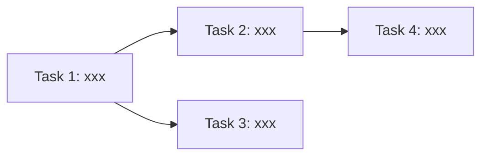

# Phase 5 实现计划模板

**每个 Phase 5 产出 tasks.md 时，必须按此格式。缺少任一字段 = 流程违规。**

---

## 文件规范

- **路径：** `raw/projects/<项目名>/changes/<变更名>/tasks.md`
- **字数上限：** ≤ 3000 字（超出必须拆分子文件）
- **粒度：** 每个 Task = 2-5 分钟可完成
- **类型：** HITL（需人工决策）或 AFK（可全自动）

---

## 头部模板

```markdown
# <项目名> — 实现计划

> **变更：** <变更名>
> **日期：** YYYY-MM-DD
> **Phase：** 5（实现计划）
> **来源：** proposal.md + constitution.md

## 依赖图



## 文件清单

| 文件 | 操作 | 涉及 Task |
|------|------|----------|
| src/xxx.mjs | 新建 | T1, T2 |
| src/yyy.css | 修改 | T3 |
| src/zzz.js | 修改 | T4 |
```

---

## Task 模板（每个 Task 必须包含以下字段）

```markdown
## Task N: <任务名>

**类型：** AFK / HITL
**角色：** coder / artist / tester
**预计：** Xmin
**依赖：** Task M（无则写"无"）

### Vertical Slice 描述
<一句话：这个 Task 做完后能独立验证什么？端到端薄切片，不是水平层。>

### 实现步骤
1. <具体步骤 1>
2. <具体步骤 2>
3. <具体步骤 3>

### 验收标准（必须可执行）
- [ ] `node -c src/xxx.mjs` 语法通过
- [ ] `curl localhost:PORT/api/xxx` 返回 200
- [ ] 浏览器访问 `http://localhost:PORT/xxx` 截图确认

### 不在范围内
- <禁止修改的文件/功能>
```

---

## 自检四问（tasks.md 写完后必须逐条回答）

1. **每个 Task 有验收标准？** — 列出所有 Task 编号，逐个确认
2. **无 TBD/TODO/占位符？** — grep 检查
3. **Vertical Slice？** — 每个 Task 是否端到端可独立验证
4. **依赖关系清晰？** — 有无循环依赖、缺失依赖

---

## 使用规则

1. **先读 proposal.md + constitution.md** — Task 内容必须注入方案细节（铁律 #11）
2. **每个 Task 必须有验收标准** — 没有验收标准 = 不允许创建 kanban 卡
3. **垂直切片优先** — 一个 Task 同时涉及前后端 > 两个 Task 分别做前后端
4. **AFK 优先** — 能自动化的 Task 优先安排，减少 HITL 等待
5. **字数超限必须拆分** — tasks.md > 3000 字 → 拆分为子文件，tasks.md 只放索引

---

## 常见错误

| 错误 | 正确做法 |
|------|---------|
| Task 描述写"实现 XXX 功能" | 必须写具体步骤：文件路径、函数名、参数 |
| 验收标准写"测试通过" | 必须写具体命令：`npm test -- --grep "xxx"` |
| 一个 Task 覆盖多个文件 | 拆分为多个 Task，每个 Task 改动范围 ≤ 3 文件 |
| HITL 和 AFK 混在一起 | 拆分：HITL Task 先执行，AFK Task 后执行 |
