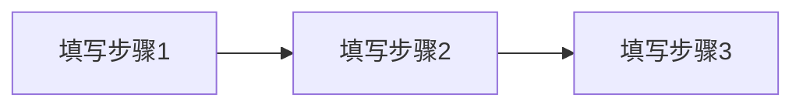

# 需求对谈记录

**项目:** [填写项目名称]
**日期:** [填写日期]
**参与角色:** [填写角色列表]

---

## 1. 需求概述

> 用一段话描述用户的核心需求。回答：这个项目要解决什么问题？

[填写]

## 2. 用户与场景

- **目标用户:** [填写]
- **使用场景:** [填写]
- **用户痛点:** [填写]
- **期望结果:** [填写]
- **用户画像:** [可选] [填写用户特征、行为模式等]
- **使用频率:** [可选] [填写预计使用频率]

## 3. 功能与流程

| # | 功能 | 优先级 | 依赖 |
|---|------|--------|------|
| 1 | [填写] | [P0/P1/P2] | [填写] |

**核心流程:**

## 4. 安全与威胁

- **主要威胁:** [填写]
- **缓解措施:** [填写]
- **敏感数据:** [填写/无]

## 5. 合规与隐私

- **合规要求:** [填写/无]
- **数据保留策略:** [填写]
- **隐私考虑:** [填写]

## 6. 行业与技术

- **行业惯例:** [填写]
- **技术约束:** [填写]
- **参考实现:** [填写/无]

## 7. 决策记录

| # | 决策 | 原因 | 替代方案 | 影响 |
|---|------|------|----------|------|
| 1 | [填写] | [填写] | [填写] | [填写] |

## 8. 跳过维度确认

> 以下维度已确认不适用本项目，请逐项说明原因。

- [ ] 安全与威胁 → [填写跳过原因/不适用]
- [ ] 合规与隐私 → [填写跳过原因/不适用]
- [ ] 行业与技术 → [填写跳过原因/不适用]
